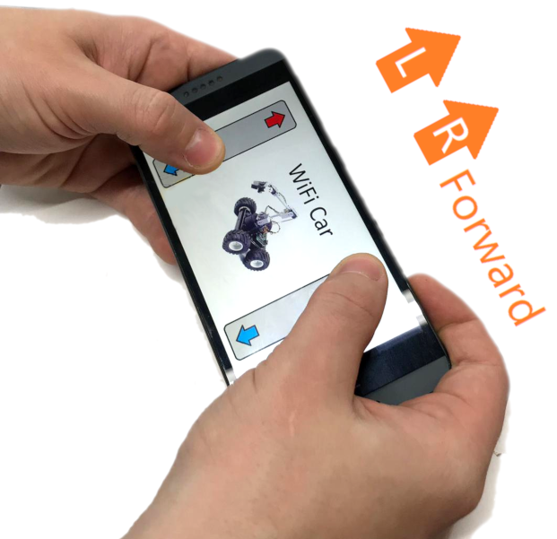

# WiFi Rover

Control our new 4WD metal Chassis car kit ([KR3166](https://jaycar.com.au/p/KR3166)) with Wi-Fi via the new MEGA board with WiFi ([XC4421](https://jaycar.com.au/p/XC4421)) Simple 2-board connection with motor shield, use this as a basis for your future robotic projects. Comes with mounting hardware.

## Bill of Materials

| Qty | Product                                  | Description           |
| --- | ---------------------------------------- | --------------------- |
| 1   | [KR3166](https://jaycar.com.au/p/KR3166) | 4WD metal chassis     |
| 1   | [XC4421](https://jaycar.com.au/p/XC4421) | MEGA with WiFi        |
| 1   | [XC4472](https://jaycar.com.au/p/XC4472) | Motor shield          |
| 1   | [HP0418](https://jaycar.com.au/p/HP0418) | M3 Screw              |
| 1   | [HP0425](https://jaycar.com.au/p/HP0425) | M3 Nut                |
| 1   | [HP0148](https://jaycar.com.au/p/HP0148) | M3 Washers            |
| 1   | [PH9251](https://jaycar.com.au/p/PH9251) | 9V DC Battery Adaptor |
| 6   | [RC5360](https://jaycar.com.au/p/RC5360) | Ceramic Caps 100nF    |

### You might also want

- Heatshrink ( [WH5524](https://jaycar.com.au/p/WH5524) )

## Software & Libraries

| Library                       | Author   | Version |
| ----------------------------- | -------- | ------- |
| Adafruit Motor Shield library | Adafruit | 1.0.1   |

You should also get the [ESP Data Upload Tool](https://github.com/esp8266/arduino-esp8266fs-plugin)

Follow the instructions to set that up.

**Note:** When uploading the ESP8266 (webserver and data upload tool) it is important to first set the board-type to `ESP8266`.

This is done by following the manual found on the product page for [XC3802](https://jaycar.com.au/p/XC3802). This allows you to set parameters and upload data to the WiFi portion of [XC4421](https://jaycar.com.au/p/XC4421).

If you have never done the [XC4421](https://jaycar.com.au/p/XC4421) before, we suggest you look at the product manual for a quick "hello world" type of example.

## Building instructions

 For instructions for how to build, check out https://jaycar.com.au/wifi-rover 

## Use

Simply connect to the website, then slide fingers up on both of the "paddles".

This will tell both the left and right pairs of motors to turn on at full speed, you can turn by reversing one side of the rover, or reverse both sides to move in reverse.

If you can't find the server / and general troubleshooting:

### In AP mode (default)

- Make sure that you can see and connect to the `WiFi Rover` network on your mobile phone;
  - If not, you might have to debug the ESP code again; disconnect the shield and put some `Serial.println` in the code so that you can see what the ESP is doing and perhaps why it is not making the Hotspot.
  - The code you are looking for is `WiFimode(WIFI_AP); WiFi.softAP(networkName, password);`
- If you can connect, but can't connect to `http://192.168.4.1`
  - Try wait a little while, as the server might not be up yet; go make a a cup of tea.
  - you can try checking the `WiFi.LocalIP()` command to get the server IP address.
  - If you have an iphone, you can try to access the `http://rover.local` website.

### In Network mode ( connecting to existing network)

- Check your router for any new connections, or anything remotely related to `esp` or `rover`.
- Try accessing `http://rover.local` on your computer
- Check the esp code for `WiFi.LocalIP()`

If these commands aren't quite helping you get it, put some `Serial.println()` in the code and see what the ESP is reporting; You can check out things on the issue tracker: <https://github.com/Jaycar-Electronics/WiFi-Rover/issues>

## Future Improvements

- The website definitely needs work; if you've done web-development work we'd love to accept a PR for a nicer interface for this Rover;
- With the simple serial commands it would be easy to add a few switches and other parameters; this would make it so we could also control servos and LEDS on the rover as well, through the web-app. Maybe headlights or a siren?

## Futher Reading

- <https://developer.mozilla.org/en-US/docs/Web/API/Touch_events/Multi-touch_interaction>
- <https://www.html5rocks.com/en/mobile/touch/>
- <https://en.wikibooks.org/wiki/C_Programming/String_manipulation>
