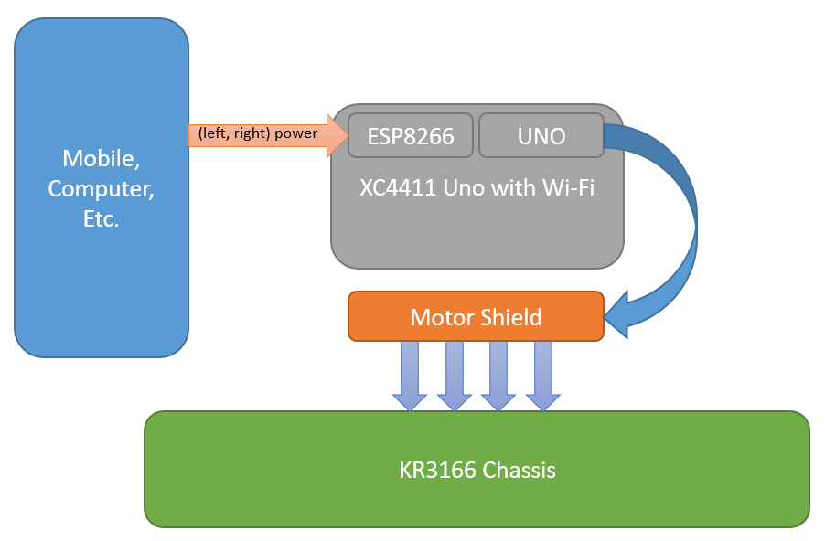
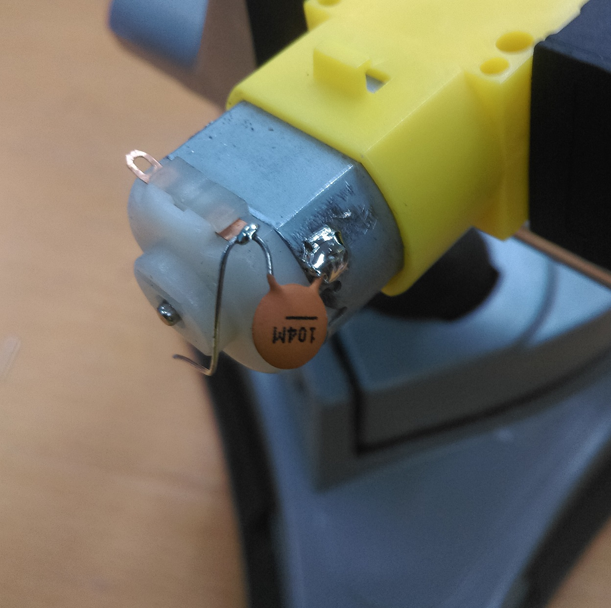
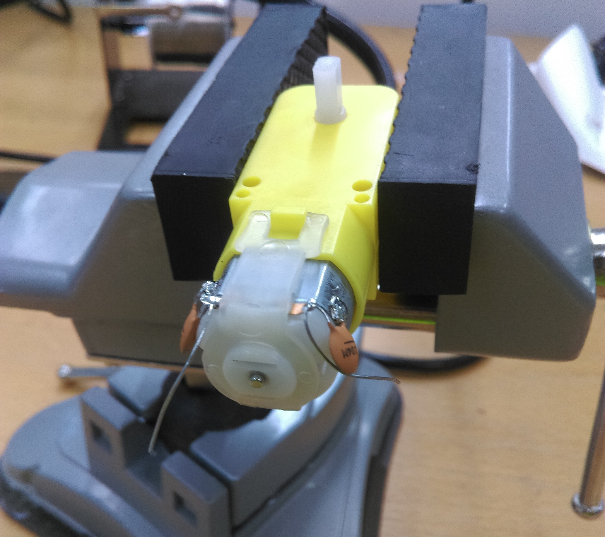
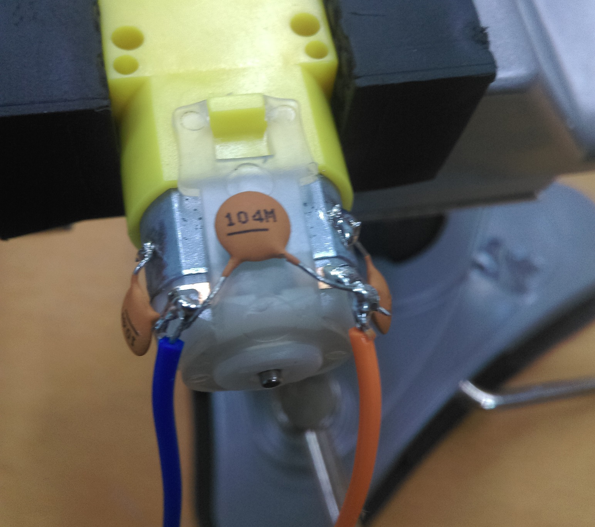
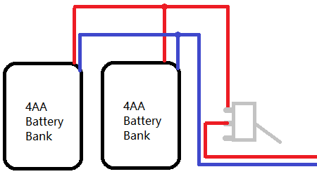
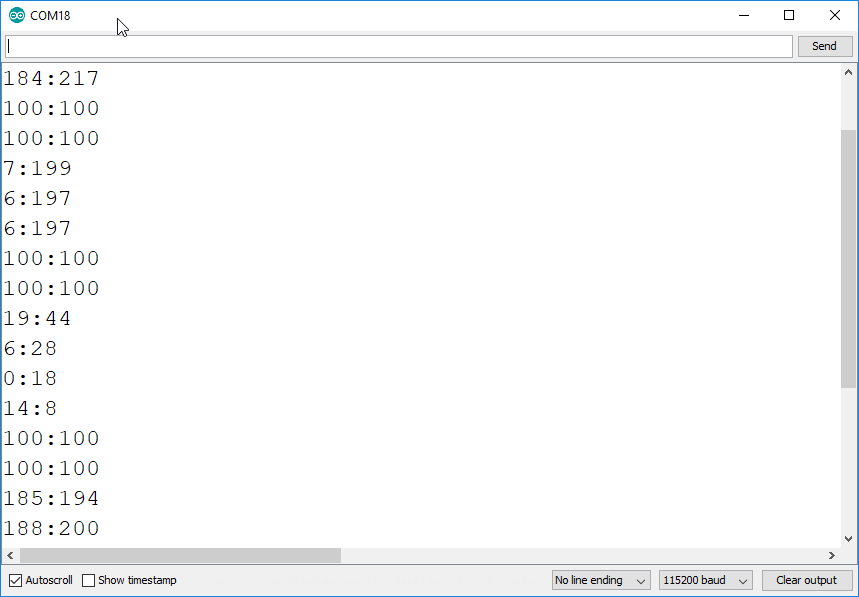

# WiFi Rover

 Control our new 4WD metal Chassis car kit (KR3166) with Wi-Fi via the new MEGA board with WiFi (XC4421) Simple 2-board connection with motor shield, use this as a basis for your future robotic projects. Comes with mounting hardware and requires 8AA batteries.

| Input        | Output         |
| ------------ | -------------- |
| WiFi Control | Motor Movement |

## Table of contents

- [WiFi Rover](#WiFi-Rover)
  - [Table of contents](#Table-of-contents)
  - [Bill of Materials](#Bill-of-Materials)
    - [You might also want](#You-might-also-want)
  - [Software & Libraries](#Software--Libraries)
  - [System Overview](#System-Overview)
    - [4-Wheeled Chassis](#4-Wheeled-Chassis)
    - [Arduino Motor Controller](#Arduino-Motor-Controller)
    - [WiFi Controller](#WiFi-Controller)
  - [Integeration](#Integeration)
  - [Use](#Use)
    - [In AP mode (default)](#In-AP-mode-default)
    - [In Network mode ( connecting to existing network)](#In-Network-mode--connecting-to-existing-network)
  - [Future Improvements](#Future-Improvements)
  - [Futher Reading](#Futher-Reading)

## Bill of Materials

| Qty | Product                                  | Description        |
| --- | ---------------------------------------- | ------------------ |
| 1   | [KR3166](https://jaycar.com.au/p/KR3166) | 4WD metal chassis  |
| 1   | [XC4421](https://jaycar.com.au/p/XC4421) | MEGA with WiFi     |
| 1   | [XC4472](https://jaycar.com.au/p/XC4472) | Motor shield       |
| 1   | [HP0418](https://jaycar.com.au/p/HP0418) | M3 Screw           |
| 1   | [HP0425](https://jaycar.com.au/p/HP0425) | M3 Nut             |
| 1   | [HP0148](https://jaycar.com.au/p/HP0148) | M3 Washers         |
| 1   | [PH9200](https://jaycar.com.au/p/PH9200) | Battery Holder 4AA |
| 1   | [RC5360](https://jaycar.com.au/p/RC5360) | Ceramic Caps 100nF |

### You might also want

- Heatshrink ( [WH5524](https://jaycar.com.au/p/HP0410) )

## Software & Libraries

| Library                       | Author   | Version |
| ----------------------------- | -------- | ------- |
| Adafruit Motor Shield library | Adafruit | 1.0.1   |

You should also get the [ESP Data Upload Tool](https://github.com/esp8266/arduino-esp8266fs-plugin)

Follow the instructions to set that up.

## System Overview



We will use our XC4411 to operate two things at once; The ESP side will provide a website for someone to connect to (this is configured for a phone in this example) and receive commands from the phone to send to the arduino.

The arduino portion of the XC4411 will then use that to power the actual motors on the KR3166 chassis.

### 4-Wheeled Chassis

We've copied the adafruit suggestions of using 3 capacitors per motor to filter out noise and electrical problems. Ultimately this is a cut copy
Use a pair of pliers to gently unhook and remove the motor strap


Then solder a small blob on either side of the motor; you will have to apply heat for a while then press the solder into the motor to get it to stick; the motor body needs to be a bit hot. Use a file to roughen up the surface if needed.


Connect a capactior as shown, with one side on the metal chassis side, and the other connecting to the motor terminal. Do this to both sides.



Then place the strap back in place, noting which way the notch is on.



Finally,
 solder a capacitor across both terminals, and solder wires to connect up to the motor shield. Here we used the same orientation of wires (Blue on left, Orange on Right) so that it's easier to visually see the orientation of the motor connections when we connect it to the shield.



Mount the motors into the chassis and put a power switch where you want.

We are connecting up the two battery packs in parallel; so that their setup looks like this:



Make sure the joins are covered so that there's no shorts happing across the metal chassis; The [WH5524](https://jaycar.com.au/p/WH5524) is great to have around the workbench for this very reason.

It might be easier to mount the mega onto the chassis at this point; you should find a position where 3 of the mounting holes on the Mega line up with the chassis; use spacers to take it up off the metal chassis and bolt it in place.

The shield should fit ontop just fine with the bolts sliding through it.

### Arduino Motor Controller

Simply connect the power from the battery packs and switch into the motor in port on the motor controller shield; that way, when the switch is powered on, it feeds the two battery banks into the `M+` and `GND` screw terminals on the motor sheild.

Connect the dip switches so that the USB serial port connects to the MEGA - which should be default; if not, switches 3 and 4 are ON and the rest are OFF.

You should be able to upload the WiFi-Rover.ino sketch to the MEGA ( making sure that the correct board and port is selected. )

This sketch works by capturing the `Serial3` data (Which can be connected to the ESP ) and splitting the data into left and right values; The real value is from the C function `strchr(char[], char);` which returns a *pointer to the string* at the first position of `char`.

```c
//suppose buffer is: "456:123";
// {'4','5','6', ':' ,'1','2','3', null}

char* seperator = strchr(buffer, ':');
//get pointer to the ':' and change that into a null character
*seperator = '\0';

//now the entire buffer is:
// {'4','5','6', null ,'1','2','3', null}
//   |            |
//   ^ buffer     ^ seperator

// we can increment seperator to point to the 1,2,3;
// effectively making 2 strings
seperator += 1
int leftPower = atoi(buffer);
// { '4', '5', '6', null } or "456" or now just 456

int rightPower = atoi(seperator);
// { '1', '2', '3', null } or "123" or now just 123
```

### WiFi Controller

The WiFi controller portion is fairly easy; We put the code for this in the `RoverServer` folder; open this folder in a new Arduino IDE window and change the Dip switches on the board to program the ESP ( switches 7, 6, 5 are ON, the rest are OFF).

When uploading code to the ESP, make sure that you change the flash-size for the sketch to use `SPIFFS` - in our screenshot below, we used the `4M` option with `2M SPIFFS`; This just means that it will reserve 2Mb of space in memory for our website.


Once the setting is configured correctly; Upload the code, then use the `ESP8266 Sketch Data Upload` tool from from the [Software & Libraries](#Software--Libraries) Section.

The ESP portion of the code simply makes a website for the user to connect to; By default, this is it's own WiFi Hotspot named `WiFi-Rover` without any password, and will host it's server on `http://192.168.4.1` - apple and other devices that support `mDNS` will be able to connect to it via the `rover.local` hostname as well. You can change the `network

Then it receives any data being sent through the `http://192.168.4.1/data` route and packages it into a `String` to send over the serial port to the Arduino. You can see here that we put the two arguments together with the `":"` between them; this corrosponds to the `':'` we search for in the arduino section.

There's some of the magic in the Website code; we use the `touchend` `touchmove` and `touchstart` event listeners in Javascript to track the number of fingerpresses on the screen;

Then, every half-second, we call the `update()` function -  if we have two fingers on the screen, we can send their position relative to the centre of the screen; if they are both in the general 'up' direction they send values relating to up, and if they are in the lower portion, they'll send values relating to down. through this, if one is up and one is down, they should send their correct values and the arduino will then move one set of motors forward and the other set backwards, so that the WiFi-Rover turns around.

```javascript

var leftTouch;
var rightTouch;

if(touches[0].pageY > touches[1].pageY){
    leftTouch = touches[1];
    rightTouch = touches[0];
} else {
    leftTouch = touches[0];
    rightTouch = touches[1];
}

//convert the value from 0 -> width; as 0 -> 255
var leftValue = parseInt((leftTouch.pageX/w) * 255);
var rightValue = parseInt((rightTouch.pageX/w) * 255);

var xhr = new XMLHttpRequest();
xhr.open("POST", "/data", true);
xhr.setRequestHeader(
    'Content-Type',
    "application/x-www-form-urlencoded; charset=UTF-8");
xhr.send(`left=${leftValue}&right=${rightValue}`);

```

You should be able to turn dip-switch `7` off, then reset the board and check the serial data through the serial port; Once you see the "Car" website, use both thumbs to drag up and down and check the data coming through the serial port:



Remember to flick switch `7` back on while programming, and any changes you to do the website will have to have the data-upload re-done.

## Integeration

Once the ESP and MEGA are working as expected; flip all dip-switches off except for switches 1 and 2, then make sure the serial selector swtich is on TX3/RX3. Then put the motor shield on top of the device and make sure all the motor and power cables are connected properly.


You should be able to reset the board; find the network, connect, load up the website on your phone and drive the motors via dragging up and down on either of the switch paddles.

## Use

Simply connect to the website, then slide fingers up on both of the "paddles".


This will tell both the left and right pairs of motors to turn on at full speed, you can turn by reversing one side of the rover, or reverse both sides to move in reverse.

If you can't find the server / and general troubleshooting:

### In AP mode (default)

- Make sure that you can see and connect to the `WiFi Rover` network on your mobile phone;
  - If not, you might have to debug the ESP code again; disconnect the shield and put some `Serial.println` in the code so that you can see what the ESP is doing and perhaps why it is not making the Hotspot.
  - The code you are looking for is `WiFimode(WIFI_AP); WiFi.softAP(networkName, password);`
- If you can connect, but can't connect to `http://192.168.4.1`
  - Try wait a little while, as the server might not be up yet; go make a a cup of tea.
  - you can try checking the `WiFi.LocalIP()` command to get the server IP address.
  - If you have an iphone, you can try to access the `http://rover.local` website.

### In Network mode ( connecting to existing network)

- Check your router for any new connections, or anything remotely related to `esp` or `rover`.
- Try accessing `http://rover.local` on your computer
- Check the esp code for `WiFi.LocalIP()`

If these commands aren't quite helping you get it, put some `Serial.println()` in the code and see what the ESP is reporting; You can check out things on the issue tracker: <https://github.com/Jaycar-Electronics/WiFi-Rover/Issues>

## Future Improvements

- The website definitely needs work; if you've done web-development work we'd love to accept a PR for a nicer interface for this Rover;
- With the simple serial commands it would be easy to add a few switches and other parameters; this would make it so we could also control servos and LEDS on the rover as well, through the web-app. Maybe headlights or a siren?

## Futher Reading

- <https://developer.mozilla.org/en-US/docs/Web/API/Touch_events/Multi-touch_interaction>
- <https://www.html5rocks.com/en/mobile/touch/>
- <https://en.wikibooks.org/wiki/C_Programming/String_manipulation>
